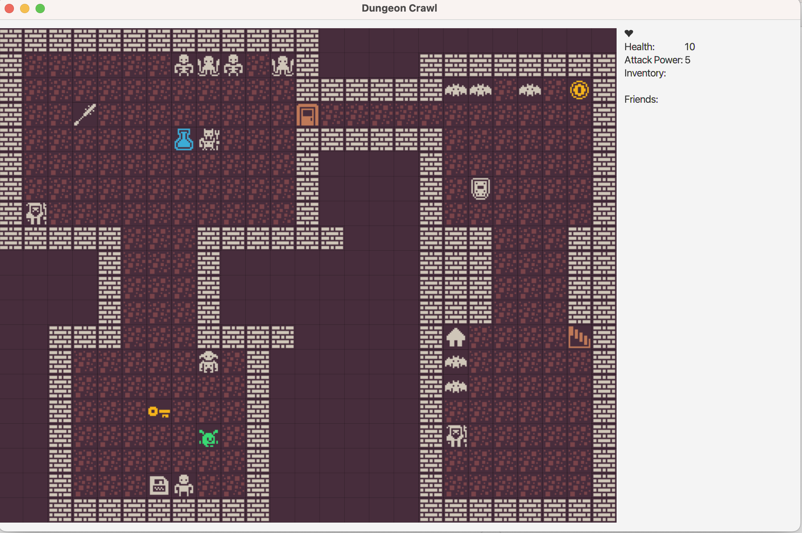

# dungeon-crawl

DungeonCrawl is a JavaFX-based, rougelike, tile-based game that connects to a PostgreSQL database. This README provides
instructions for setting up the project, building it, and running it on your local machine using Maven.

# Contributors:

- Oláhné Klár Erika: https://github.com/o-k-e
- dr. Ditrói-Tóth Zsuzsa: https://github.com/DTZsuzsi

# Git repository:

https://github.com/CodecoolGlobal/dungeon-crawl-java-DTZsuzsi.git

# Prerequisites

Before running the project, ensure you have the following software installed on your system:

- Java (JDK 8 or above)
- Maven (for building the project)
- PostgreSQL (for the database connection)

# Install Java and Maven

To verify that Java and Maven are installed, run the following commands:

```
java -version    
mvn -v 
```   

If Java or Maven is not installed, download and install them:

- to install Java follow this link: https://www.oracle.com/java/technologies/downloads/#java11?er=221886
- to install Maven follow this link: https://maven.apache.org/install.html
- to set Up PostgreSQL Database follow this link: https://www.postgresql.org/download/
- Ensure you have a PostgreSQL instance running. If you don't have PostgreSQL installed, follow the installation
  instructions for your platform:
  PostgreSQL Installation Guide on this link: https://www.postgresql.org/docs/current/installation.html

# Project Setup

1. Clone the Project
   Clone this project to your local machine using Git:

```  
   gh repo clone DTZsuzsi/dungeoncrawl
   cd dungeoncrawl
```

2. Set Environment Variables
   You need to set the following environment variables for PostgreSQL:
   ```
   export DB_NAME="dungeoncrawl"
   export DB_USERNAME="yourusername"
   export DB_PASSWORD="yourpassword"
   export DB_PORT="yourportfordatabase"
   ```

   Make sure to replace the values with the actual details for your PostgreSQL database.

3.
    3. Run the Application

The run.sh script automates the setup process, including:

- Checking for required installations (Java, Maven, PostgreSQL)
- Creating the PostgreSQL database and user if they don't exist
- Building the project with Maven
- Running the application

## Troubleshooting

### Maven Dependency Issues

If you encounter dependency issues, try the following:

1. Force Maven to update its local cache and download the latest dependencies:

   ```
   mvn clean install -U
   ```

2. If the problem persists, delete the cached dependencies from your local Maven repository (usually located
   at `~/.m2/repository`) and re-run the above command.

### Missing or Outdated Dependencies

If a dependency version is not recognized, specify the correct version in your `pom.xml`. For example, to include
JavaFX:

```xml

<dependencies>
    <dependency>
        <groupId>org.openjfx</groupId>
        <artifactId>javafx-controls</artifactId>
        <version>17.0.2</version>
    </dependency>
</dependencies>
```

After updating `pom.xml`, run:

```
mvn clean install -U
```

### About the program

If you succeeded and the program is running, you should try the game itself. Your main goal is, to survive the monsters attacks,
and through the stairs go to the final round, fighting against the boss and win the game! You can move with the arrow keys.
The monsters will attack you if you can't escape. Luckily, you will have helper friends on the way (Yoda, who gives you health, the shopkeeper with fantastic items),
you can find potions, artifacts to help you. You can always check your inventory, health and attack power on the right side. Good luck!




## Notes

- **JavaFX Support:** This project requires JavaFX 11 or higher. If you're using Java 8, JavaFX is bundled with the JDK.
  For Java 11 or later, JavaFX must be added as a dependency in `pom.xml`.
- **Database Setup:** The `run.sh` script automates the database creation and user setup if environment variables are
  set correctly.

